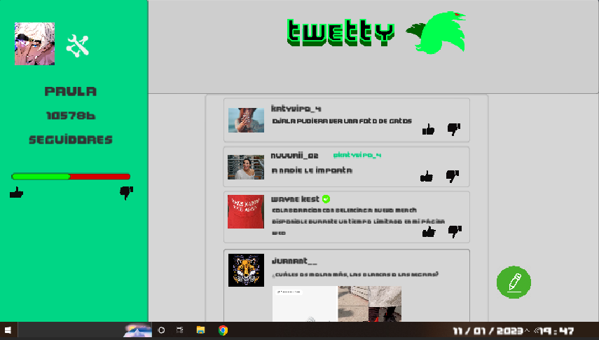
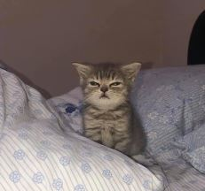
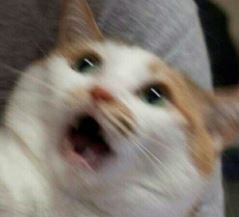
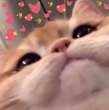
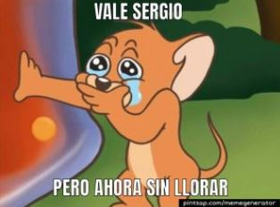
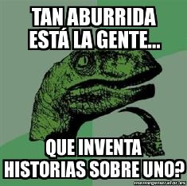
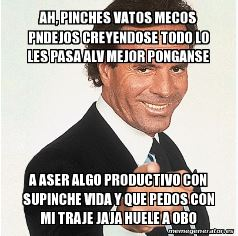
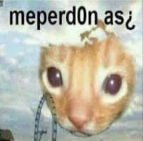

# Juegos-Serios

**Proyecto Final - GDD**

**Trabajo realizado por: Eva Sánchez, Paula Morillas y Sara Isabel García**

## 0. Descripción del juego:

Fight Cancel es un videojuego breve (20 minutos aproximadamente) de un solo jugador que pertenece al género de novela gráfica y simulación con toma de decisiones.

## 1. Propósito:

La idea es que el juego genere en el usuario una sensación de frustración y angustia que represente la situación que viven las personas que sufren los efectos de la cultura de la cancelación. Con esto se busca concienciar a los más jóvenes acerca de los peligros del Internet y de las consecuencias duraderas que pueden acarrear sus acciones en las redes sociales.

## 2. Target: 

El target principal de este juego son los jóvenes entre 12 y 16 años, ya que poseen conocimientos mínimos acerca de las redes sociales y están empezando a usarlas de forma independiente, sin llegar a comprender los peligros que acarrean. 

## 3. Aplicaciones:  

Este videojuego puede ser utilizado en aulas o charlas informativas para explicar de manera sencilla a los asistentes cómo funciona la cultura de la cancelación y cómo puede deteriorar de manera psicológica a los afectados.
El único requisito es que el docente que dirige la acción tenga ciertos conocimientos sobre las redes sociales y las situaciones que se dan en éstas. La idea es que durante la sesión los alumnos jueguen de forma independiente aprendiendo por su cuenta, siguiendo el método de enseñanza “Student-centered”.

## 5. Jugabilidad: 

### 5.1. Mecánicas:

#### 5.1.1. Jugador: 

**Click:** Todos los elementos interactuables por el jugador se realizan con un clic del ratón. El jugador podrá interactuar con el botón de “comentar”, y dar “me gusta” o “no me gusta” a las publicaciones del feed donde se muestran comentarios que mencionan al jugador.

#### 5.1.2.Escenario: 

**Toma de decisiones:** Son los elementos que permiten tomar decisiones a lo largo del juego, que conducen a una serie de eventos u otros.
- Post de comentarios
- Post de fotos

**Elementos corrientes:** Son elementos que permiten al jugador interactuar con el entorno y tener una sensación de realismo. Realmente no influyen en el desarrollo del juego. 
- Comentarios de usuarios aleatorios
- Likes en los comentarios
- Dislikes en los comentarios 
- Botón de paso de los días
- Botón de ajustes de foto y nombre de usuario
- Monólogos del jugador, que aparecen al inicio de cada día (Aparecen al hacer click,    mostrándose con una velocidad constante)

**Pop ups:** Avisos que aparecen en la esquina inferior derecha de la pantalla y que aportarán información al jugador sobre diferentes eventos (notificaciones, bloqueos de usuarios, avisos de la red social)

### 5.2. Controles: 

**Ratón:** Es juego funciona como un point and click, teniendo que seleccionar entre diferentes tipos de publicaciones y pudiendo dar al like o dislike, además de tener que mantener presionado para desplazar la ventana de comentarios. 

**Escape:** Permite abrir el menú de pausa cuando estás en el juego. 

### 5.3. Cámara: 

La perspectiva del juego es en primera persona ya que simula ser una pantalla de ordenador.

## 6. Menús e interfaz: 

Contamos con un menú principal de juego, además de un menú de pausa. 

**Menú principal:** El menú principal cuenta con dos botones, uno para salir del juego y otro para iniciar una partida. 

**Menú de pausa:** Permite continuar la partida, volver al menú principal o salir del juego. 

**Interfaz:** A la izquierda muestra el "perfil" del jugador con su imagen, número de seguidores y la proporción de likes/dislikes que tiene. La mayor parte de la interfaz la ocupa el "feed" que muestra comentarios de otros usuarios, permite hacer publicaciones etc.

## 7. Dinámica: 

El objetivo de Fight Cancel consiste en evitar ser víctima del proceso de cancelación, tomando las decisiones que crea mejores para disminuir la opinión negativa del público general, ya sea haciendo publicaciones o dando al like o dislike. Esto se verá reflejado mediante el incremento o disminución de seguidores o la llegada de comentarios negativos, cada vez más abundantes. 

Debido a que es un juego de historia lineal, los días no pasarán hasta que el jugador haga las acciones predeterminadas para ese día. Las decisiones tomadas tampoco afectarán al final del juego, ya que el personaje llegará a un punto donde tendrá que decidir si abandonar la red social o no, a pesar de haber sido cancelado por la mayor parte de los usuarios. 

## 8. Estética: 

**Colores:** Este juego posee una paleta de colores pasteles en la que domina el verde menta, color principal de la red social del juego. Además, los elementos interactuables tendrán una serie de colores vivos, que permitan que destaquen.

**Temática:** El jugador pretende incrementar su fama como influencer por lo que la historia se desarrolla en la web, concretamente en una red social basada en Twitter llamada Twetty. Por ello el escenario es la pantalla del ordenador del jugador. El cambio de día se representará cerrando sesión y apagando el ordenador.

## 9. Contenido: 

La toma de decisiones no estará limitada a un tiempo concreto, pero se espera que la duración total del juego sea de aproximadamente unos 20 minutos.

### 9.1. Historia: 

El jugador encarna a un/a adolescente que pretende aumentar su fama como influencer. En el proceso tomará una serie de malas decisiones en Twetty, que provocarán el inicio de su proceso de cancelación. 
El objetivo del jugador será intentar evitar ser cancelado, mientras sufre las consecuencias de sus decisiones, tanto pasadas como presentes. 
El juego transcurre durante un periodo de 5 días y según van pasando, el jugador tendrá cada vez más dificultades para mantener su imagen intacta.
 
### 9.2. Niveles: 

Solo hay un nivel en todo el juego dividido en varios “días”, debido a que es una aventura gráfica lineal, donde la mayor dificultad reside en la toma ocasional de decisiones. 

Las decisiones de cada día están indicadas a continuación: 

**Dia 1:**

Habrá 4 comentarios en el feed: 3 aleatorios y 1 de Wayne Kest (ver en el apartado 9.3)

Durante este día, el jugador:
- Debe dar like al post de Wayne Kest (esto afectará en el Día 3, cuando se descubra nueva información negativa sobre esa celebridad).
- Postear un comentario, teniendo que elegir entre:
  - “Que ganas de que llegue mi pedido de la nueva colección de Wayne Kest con Belenciaga”
  - “Me alegro mucho por Wayne Kest y su nueva colección con Belenciaga”
  - “Menos mal que hice mi pedido de la nueva colección de Wayne Kest a tiempo”
- Publicar un meme, pudiendo elegir entre 3:

- Publicar un comentario como respuesta a uno de sus seguidores sobre unas zapatillas (este comentario será utilizado durante el Día 2):
  - “Me gustan más las negras”
  - “Me gustan más las blancas”

**Dia 2:**

Habrá 5 comentarios en el feed: 2 sin importancia, 1 de Wayne Kest, 1 del fan y 2 del hater:

- Wayne Kest intentará eliminar los rumores negativos hacia su persona
- El hater (ver en el apartado 9.3) saca de contexto el último comentario del jugador del Día 1
- El hater hace una broma de mal gusto, dirigida hacia el jugador
- El fan (ver en el apartado 9.3)  escribe: “Me parece muy fuerte que haya gente que piense que formes parte de una estafa en fin xdd”

Durante este día, el jugador:

- Hace un comentario un poco brusco, pudiendo elegir entre:
  - “Muy graciosos los comentarios de los haters sobre las zapatillas ¿Qué habéis desayunado hoy, un payaso?”
  - “Hay gente muy original en Twetty, y si en vez de comentar sobre mis respuestas os dedicais a algo más productivo (la de trabajar no os la sabeis xd)”
  - “He visto varias reacciones negativas a mi comentario sobre las zapatillas. Yo solo quería compartir mi opinión. Parece que hoy en día ya no se puede comentar nada sin recibir críticas negativas”
- Publica un meme para responder a un comentario del hater, pudiendo elegir entre 3:

**Dia 3:**

Habrá 6 comentarios en el feed: 1 de la cadena de noticias CBB, 2 de odio dirigidos hacia Wayne Kest y al jugador, 1 foto satírica y 1 del fan:

- CBB habla sobre el escándalo de Wayne Kest.
- Comentarios simples, empezando la gente a bloquear y cancelar al jugador por haber estado del lado de la celebridad.
- Una imagen editada para burlarse del jugador y la celebridad. 
- El fan pide paciencia para que el jugador se explique

Durante este día:

- El jugador postea una disculpa respecto al hecho anterior a elegir entre:
  - “Yo no tengo nada que ver con Wayne Kest o la marca con la que colabora”
  - “Pido perdón por lo que dije y lo que se pudo interpretar. No conocía las intenciones de la marca ni lo que hacían en la sombra. No se me dijo nada”
  - “Estoy de acuerdo con vosotros, lo que hicieron Wayne Kest y Belenciaga no estuvo bien y espero que pidan disculpas”
- Al final del día recibe el primer aviso de Twetty sobre que su verificado será retirado

**Dia 4:**

Habrá 3 comentarios de odio en el feed: 2 de usuarios, 1 imagen:
- Se ríen de la disculpa del jugador del día anterior
- Imagen que hace referencia a la disculpa:

Durante este día, el jugador:
- Empezará a ser bloqueado por los usuarios
- Recibe un aviso de Twetty sobre el estado de su símbolo de verificado, el cual será retirado
- El jugador no podrá postear nada, debido a que no se siente con fuerzas para ello.

**Dia 5:**

El dia comienza con la pantalla del ordenador en negro. A continuación se inicia un monólogo tras el cual, aparecerá la pantalla de inicio y el jugador tendrá que decidir si: 

- Eliminar su cuenta, siendo esta suspendida.
- Continuar en la red social, siendo su cuenta bloqueada por la red social. 

En ambos casos, el juego terminará con el jugador perdiendo frente al proceso de cancelación.

### 9.3. Personajes: 

- **Protagonista:** Es el personaje que maneja el jugador, siendo un influencer que, tras una serie de sucesos, es cancelado en las redes sociales. Su objetivo es no perder su popularidad y arreglar los problemas que lo han llevado a esa situación.
- **Wayne Kest:** Una celebridad que realiza acciones bastante polémicas. La reacción del protagonista a algunas de sus publicaciones afectarán de forma negativa a su popularidad.
- **Fan:** Esta persona empieza apoyando al jugador, pero su intensidad y confianza irán disminuyendo conforme vayan avanzando los días. 
- **Hater:** Hace publicaciones negativas y tergiversa las publicaciones del protagonista. 
- **Personas anónimas de Internet:** Varios usuarios aleatorios que reaccionan a los comentarios del jugador, además de poner sus propios comentarios.

## 10. Referencias:

- Get Bad News (Videojuego) 
- Simulacra (Videojuego)
- Twitter (Red social - Estética y nombre)
- Instagram (Red social - Estética)
